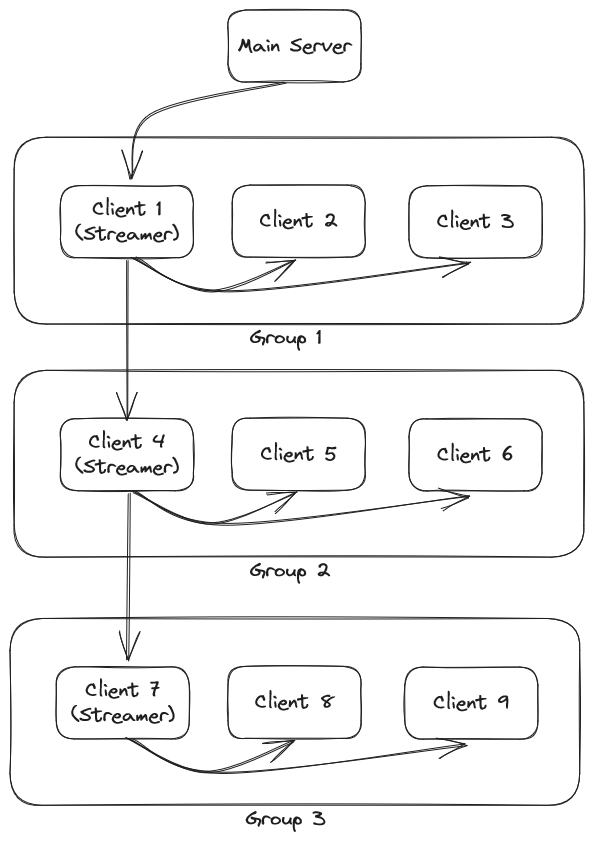

# Daisy-Chain RTSP Koordinatör Sistemi

Bu proje, RTSP (Real Time Streaming Protocol) yayınları oluşturmak ve yönetmek için bir istemci-sunucu yapısı oluşturmaktadır. Sunucu, RTSP yayınlarını koordine eder ve istemcileri gruplara ayırarak yayınları dağıtır. Her grubun bir adet yayıncısı vardır. Bu yayıncı kendi grubundaki istemcilere ve başka bir grubun ana yayıncısına yayın yapar. Bu şekilde ana sunucunun güç gereksinimi düşürülür.



## Başlangıç

Bu projeyi yerel makinenizde çalıştırmak için aşağıdaki adımları takip edebilirsiniz:

1. **Gereksinimleri Yükleme:** İlk olarak, projeyi çalıştırmak için gereken Python paketlerini yüklemelisiniz. Bunun için aşağıdaki komutları kullanabilirsiniz:

```
pip install websockets redis PyQt5 opencv-python
```

2. **Redis Başlatma:** Bu sistem redis sunucusu gerektirmektedir. Docker üzerinden redis sunucusu önerilmektedir.

```
docker pull redis
docker run redis
```

3. **Mediamtx ve ffmpeg Sunucu Yükleme:** Bu projede RTSP sunucusu olarak [mediamtx](https://github.com/bluenviron/mediamtx) kullanılmıştır. Mediamtx ve ffmpeg ilgili klasörlere eklenmelidir.


4. **Sunucu Başlatma:** Sunucuyu başlatmak için `server.py` dosyasını çalıştırmanız gerekmektedir:

```
python server.py --ipv4 <SUNUCU_IP_ADRESI> --max-member <GRUP_ISTEMCI_SAYISI>
```
<em>GRUP_ISTEMCI_SAYISI: Gruplar kaç kişilik olsun.</em>

5. **İstemci Başlatma:** İstemci tarafında, RTSP yayınlarını izlemek ve yönetmek için bir arayüze sahip olan `client.py` dosyasını çalıştırabilirsiniz:

```
python client.py --ip <SUNUCU_IP_ADRESI>
```

6. **Yayın Kontrol Arayüzü Başlatma:** RTSP yayını başlatmak ve durdurmak için bir arayüz sunan `stream-client.py` dosyasını çalıştırabilirsiniz:

```
python stream-client.py
```


## Proje Yapısı

Projede yer alan ana dosyalar ve klasörler şunlardır:

```
Klasör yapısı:
│    client.py
│    server.py
│    stream-client.py
├─── ffmpeg
│       ffmpeg.exe
├─── mediamtx
│       mediamtx.exe
│       mediamtx.yml
```

- **client.py:** İstemci tarafını temsil eden kod dosyası. RTSP yayınlarını izlemek ve yönetmek için kullanılır.

- **server.py:** Sunucu tarafını temsil eden kod dosyası. Grup yönetimi ve RTSP yayını koordinasyonu için kullanılır.

- **stream-client.py:** RTSP yayınlarını başlatıp durdurmak için kullanıcı arayüzü sunan kod dosyası.

- **[mediamtx](https://github.com/bluenviron/mediamtx):** RTSP yayını için `mediamtx.exe` ve `mediamtx.yml` dosyalarını içeren klasör.

- **[ffmpeg](https://ffmpeg.org/):** RTSP yayınını işlemek için `ffmpeg.exe` dosyasını içeren klasör.

## Lisans

Bu proje [MIT Lisansı](LICENSE) ile lisanslanmıştır.

